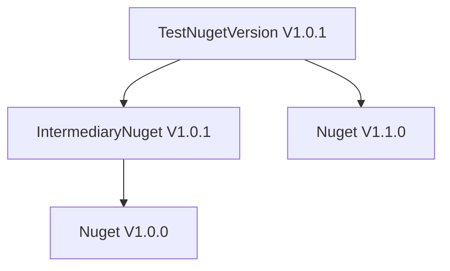
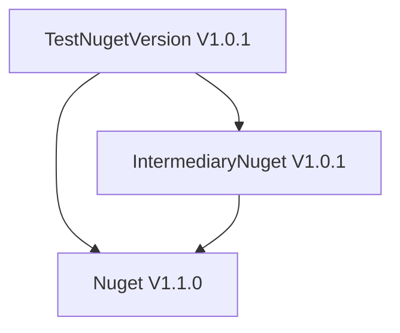

# TestNugetVersion

This project is designed to test and validate different versions of NuGet packages. It serves as a sandbox environment for experimenting with package dependencies, versioning, and compatibility.

## Features
- Test NuGet package installations.
- Validate version compatibility.
- Experiment with dependency resolution.

## Requirements
- .NET SDK installed.
- NuGet CLI or Visual Studio.

## Usage
1. Clone the repository.
2. Install the required dependencies.
3. Run the project to test NuGet versions.

# Result
The TestNugetVersion solution use both IntermediaryNuget and Nuget 
## Dependency Diagram

Below is a simple representation of the project dependencies:

At run time we have

